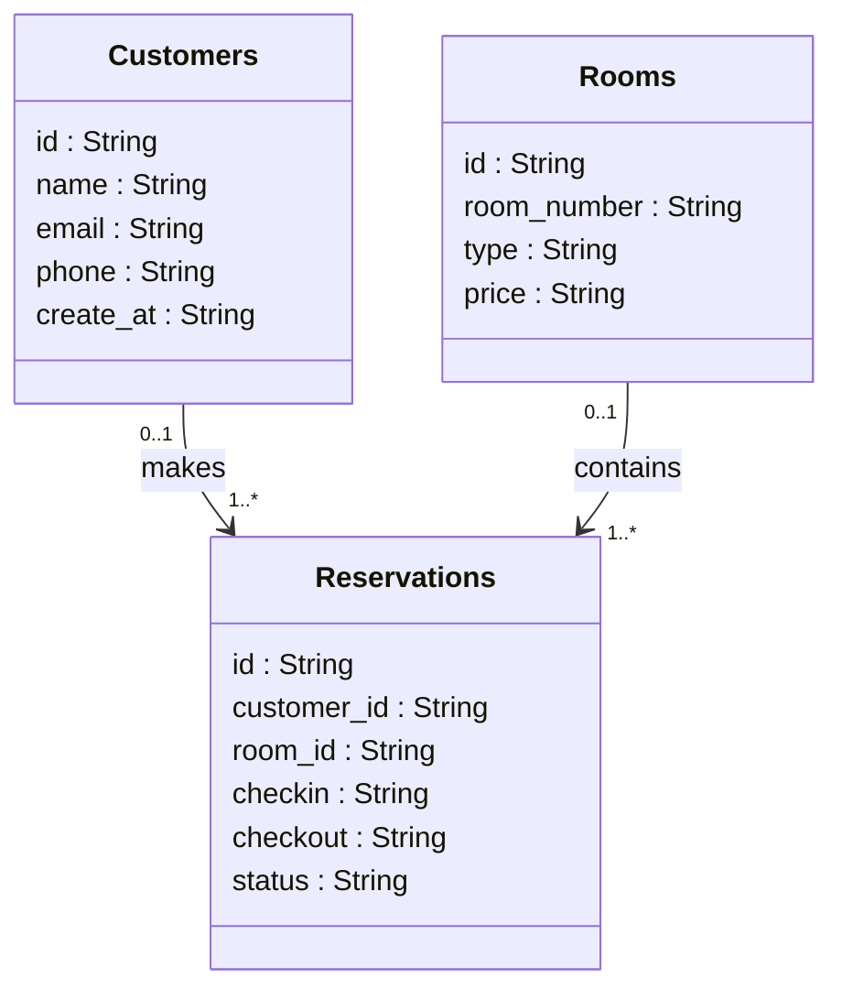

```mermaid
classDiagram
    class Customers {
        id : String
        name : String
        email : String
        phone : String
        create_at : String
    }

    class Reservations {
        id : String
        customer_id : String
        room_id : String
        checkin : String
        checkout : String
        status : String
    }

    class Rooms {
        id : String
        room_number : String
        type : String
        price : String
    }

    Customers "0..1" --> "1..*" Reservations : makes
    Rooms "0..1" --> "1..*" Reservations : contains

```